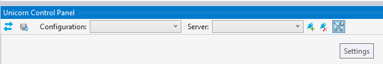

# Unicorn Control Panel

---------------------------------------

Allows you to use [Unicorn](https://github.com/kamsar/Unicorn) from Visual Studio.
With this extension you can synchronize your Sitecore items without leaving Visual Studio.

See the [changelog](CHANGELOG.md) for changes and roadmap.

## Connecting to Unicorn

For control panel to work, you have to provide connection information about Sitecore instance you want to use control panel with.
Unicorn Control Panel requires that Unicorn version 2.0.4 or 3 (rc2 or later) to be installed on the instance. (https://www.nuget.org/packages/Unicorn)

To create new connection follow the steps:

1. Click on the "Create New Connection" button to add connection 

1. Specify connection info: Name, Server Url and [Security token/SharedSecret](https://github.com/kamsar/Unicorn#automated-deployment) if needed.
1. Click "Save"

### Unicorn 2.x

Click on install and specify a path to Sitecore webroot folder. Unicorn.Remote.dll and Unicorn.Remote.config will be copied to your Sitecore instance.
If you don't have an access to Webroot folder you can download a package and install it.

### Unicorn 3.x

In Unicorn 3+ remote API is disabled by default, to enable it, remove "disabled" extension from  `App_Config/Include/Unicorn/Unicorn.Remote.config.disabled` file.

### Unicron 3.1 

In this version remote API endpoint (/unicornRemote.aspx) was removed, VS control panel can now access Unicorn directly by it standard endpoint (/unicorn.aspx). 
Please make sure to change it in your settings. (Settings -> EndPoint URL).

## Settings

Settings has following options:

1. EndPoint - used to specify the custom endpoint of Unicorn server.
Default value is "/unicornRemote.aspx". (/unicorn.aspx for Unicorn 3.1)
NOTE: This value should correspond to the value set in Unicorn.Remote.config
1. "Enable multiple configurations selection" - if selected allows you to select multiple configurations for sync.
1. "Check for configuration health" option allows you to turn on/off a check for configuration state.
You want to turn it off if your version of Unicorn does not support it. (supported from 3.1+).
This option is enabled by default.

## License
[Apache 2.0](LICENSE)